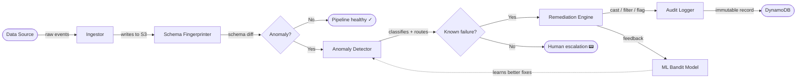
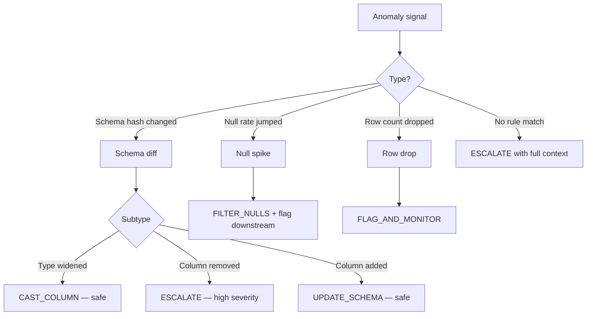
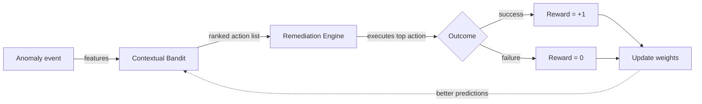
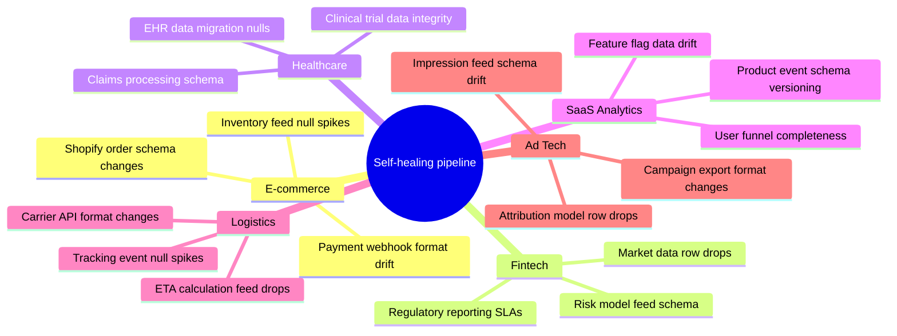
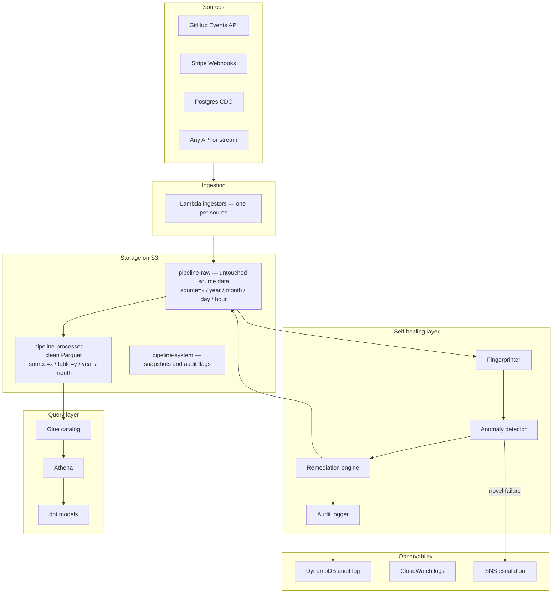

# 🔧 Self-Healing Data Pipeline

> A data pipeline that detects its own failures, fixes them automatically, and only wakes a human for problems it has never seen before.

---

## The Problem

Data pipelines break constantly. Schema changes from upstream APIs, null spikes from sensor failures, row drops from network issues. Every break pages a data engineer — usually at 2am — for problems that are almost always fixable with a type cast or a filter. The engineer fixes it in five minutes, goes back to sleep, and the cycle repeats.

**Most pipeline failures don't need a human. They need a rule and a retry.**

This project wraps your pipeline execution layer with a system that detects anomalies, applies the right fix automatically, logs every action for auditability, and only escalates genuinely novel failures that it cannot handle.

---

## How It Works



The pipeline runs on a 60-second loop. Every batch is fingerprinted. Every anomaly is classified. Every fix is logged. Humans only get paged for failures the system has no rule for — and every time a human fixes one of those, the system learns a new rule.

---

## The Four Components

### 1 — Metadata Collector

Every pipeline run produces a fingerprint:

- **Schema hash** — a single value representing the column names and types. Any change flips the hash immediately.
- **Null rate per column** — tracked against a rolling 14-day baseline. A spike is flagged when a column's null rate jumps by more than 20 percentage points.
- **Row count** — compared against the seasonal baseline. A drop below 50% of the expected count triggers a `ROW_DROP` event.
- **SLA timestamp** — wall-clock time the batch completed vs the committed delivery window.

This fingerprint is written to S3 after every run and compared to the previous snapshot. The diff drives everything downstream.

---

### 2 — Anomaly Detector

The detector classifies each anomaly signal and matches it against a rulebook. Three statistical approaches handle three different signal shapes:



**Schema drift** uses fingerprint hash comparison — instant, zero false positives.

**Null spikes** use a z-score on a rolling 14-day baseline, with STL seasonal decomposition applied first to remove day-of-week patterns. This eliminates the false positives you get from comparing a Monday batch to a Saturday baseline.

**Row drops** use the same seasonal baseline. A drop below 50% of the expected count is a hard trigger regardless of z-score — missing data is always worth investigating.

---

### 3 — Remediation Engine

The engine is **rule-based on purpose**. Machine learning in the hot path of auto-remediation is dangerous — you don't want a model guessing a fix at 2am. The rules are explicit, auditable, and human-readable.

| Anomaly | Fix | Safe to auto-apply? |
|---|---|---|
| `integer` → `float` | Widen column type | ✅ Yes — no data loss |
| `integer` → `string` | Cast column to varchar | ✅ Yes — values preserved |
| `float` → `integer` | Cast + flag for review | ⚠️ Truncation risk |
| Column added | Add to schema catalog | ✅ Yes — additive |
| Column removed | Escalate immediately | ❌ No — breaks downstream |
| Null spike | Filter rows + flag | ✅ Yes — with audit entry |
| Row drop | Flag + monitor next run | ✅ Yes — no structural change |
| No matching rule | Page human with full context | ❌ Novel failure |

Every auto-fix is followed by a verification step — the system checks that the pipeline completed successfully and row counts recovered before writing a `SUCCESS` to the audit log.

---

### 4 — Audit Log

Every action the system takes is written to an immutable record:

```
event_id:       uuid
pipeline_id:    github-events
anomaly_type:   NULL_SPIKE
column:         actor_hash
old_null_rate:  0.004
new_null_rate:  0.81
action_taken:   FILTER_NULLS
rows_dropped:   823
outcome:        SUCCESS
duration_ms:    412
timestamp:      2026-05-23T02:14:33Z
```

This record exists for three reasons. First, downstream consumers can query it to understand why their data looks different today. Second, compliance and audit requirements in regulated industries demand a traceable chain of custody for every data modification. Third, the ML layer reads it as training signal.

---

## The ML Layer

The rule-based engine handles known failure patterns. The ML layer handles the question: *for this specific pipeline, which fix works best?*



- Pipeline ID and table name — encoded as feature vectors
- Anomaly type and severity
- Time of day and day of week — anomalies behave differently at month-end
- Historical success rate of each action for this pipeline

And outputs a ranked list of remediation actions to try. Early on, it defers to the rule-based defaults. Over weeks of operation, it learns which fix works fastest for which pipeline — shaving recovery time and reducing false escalations.

The feedback signal is binary: did the pipeline complete successfully within SLA after the remediation? Simple reward, fast learning, no hallucinated fixes.

---

## Where This Applies



The healing engine is **source-agnostic**. The only thing that changes between use cases is the ingestor — the single function that pulls data from the upstream source. The fingerprinter, anomaly detector, remediation engine, and audit logger are identical regardless of whether the data comes from a GitHub API, a Shopify webhook, a Postgres CDC stream, or a Kafka topic.

---

## Data Engineering Architecture



### Storage layout

Three buckets with a clear contract between them:

**`pipeline-raw`** — untouched source data exactly as it arrived. Hive-style partitions (`source=x/year=y/month=m/day=d/hour=h/`) make every prefix queryable by Athena without a full scan. Lifecycle policy moves data to Glacier after 90 days and deletes after 365.

**`pipeline-processed`** — cleaned, typed, deduplicated data in Parquet format. Parquet reduces Athena query costs by roughly 10× compared to raw JSON by allowing column pruning and compression.

**`pipeline-system`** — schema snapshots, audit flags, Athena scratch space. Versioning on, no lifecycle deletion — these are operational records.

Adding a new source means writing one new ingestor and pointing it at `pipeline-raw/source=new-source-name/`. Nothing else in the stack changes.

---

## What Self-Healing Means in Practice

**Without this system — a type change at 2am:**

```
02:14  Upstream API changes order_id from integer to string
02:14  Pipeline fails on type mismatch
02:14  PagerDuty wakes up an engineer
02:31  Engineer identifies the column, writes a cast, deploys fix
02:38  Pipeline restarts — 24 minutes of data missing
09:00  Stakeholders ask why yesterday's numbers look odd
```

**With this system:**

```
02:14  Upstream API changes order_id from integer to string
02:14  Fingerprinter detects schema hash change
02:14  Anomaly detector: TYPE_CHANGED integer → string, severity LOW
02:14  Remediation engine casts column, retries pipeline
02:14  Pipeline completes — audit log entry written
02:14  No human paged
09:00  Engineer reads what happened over morning coffee
```
--

*Built to stop the 2am pages that nobody should be getting.*
